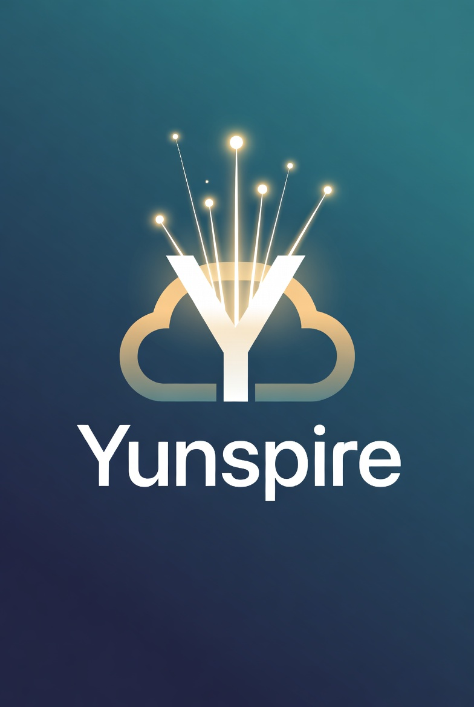

<!-- Banner -->
<div align="center">
  
</div>

<div align="center">

# Yunspire

### AI-Native Motion Comic & Video Creation Platform
**Render Noise into Narrative**

[](LICENSE)
[](https://www.python.org/)
[](https://nodejs.org/)
[](https://github.com/yun-coder/Yunspire)

[English](README_EN.md) · [中文](README.md) · [Changelog](CHANGELOG.md) · [Contributing](CONTRIBUTING.md)

</div>

---

Yunspire 是一个 **AI 原生的短漫剧 & 视频创作平台**。它将创意文本转化为可发布的动态视频，提供从剧本分析到成片导出的完整创作链路，同时支持独立的图像/视频生成能力。

Yunspire 目前包含两个核心模块：

| 模块 | 定位 |
|------|------|
| **Yunspire Studio** | Pipeline-first 漫剧/视频生产（剧本→分镜→资产→视频→合成→导出） |
| **Yunspire Playground** | 独立图像/视频生成工具台（无需剧本上下文，即开即用） |

---

## ✨ 核心能力

<table>
<tr>
<td width="50%">

### 🎬 Studio — 全链路漫剧生产

- **深度剧本分析** — LLM 自动提取角色/场景/道具，生成结构化分镜脚本
- **可控美术指导** — 自定义视觉风格，全片画风统一
- **多模型资产生成** — 角色三视图、场景定调图、道具参考图
- **AI 分镜视频** — I2V / R2V 多模式视频生成 + 批量抽卡
- **智能配音** — CosyVoice / Qwen3-TTS 多音色对白合成
- **一键合成导出** — 时间线编辑 + FFmpeg 拼接成片

</td>
<td width="50%">

### 🎨 Playground — 独立生成工具台

- **6 种生成模式** — 图像生成、文生视频、图生视频、参考生视频、视频编辑
- **10+ AI 模型** — GPT-Image-2、Wan 2.7、Seedance 2.0、Kling V3、Vidu Q3、HappyHorse 等
- **动态参数** — 每个模型独立参数（尺寸/分辨率/时长/画质）
- **并发任务** — 多任务同时执行，实时状态追踪
- **Prompt 模板** — 收藏/复用/历史记录
- **画廊视图** — 网格/画廊切换 + 详情面板

</td>
</tr>
</table>

---

## 🎯 支持的 AI 模型

| Provider | 模型 | 能力 |
|----------|------|------|
| **DashScope** | Wan 2.7 Image/Video, Qwen Image 2.0, HappyHorse 1.0 | T2I, I2I, I2V, R2V, T2V, V2V |
| **DashScope** | Kling V3 | I2V, R2V |
| **DashScope** | Vidu Q3 Pro / Turbo | I2V, R2V |
| **DashScope** | PixVerse V6 / C1 | I2V, R2V |
| **MuleRun** | Seedance 2.0 | T2V, I2V, R2V |
| **MuleRun** | GPT-Image-2 | T2I, I2I (含 4K) |
| **Kling 原厂** | Kling V3 | I2V, R2V |
| **Vidu 原厂** | Vidu Q3 Pro / Turbo | I2V, R2V |
| **DashScope** | CosyVoice, Qwen3-TTS | TTS 配音 |
| **DashScope** | Qwen 3.7 Plus | 剧本分析、Prompt 润色 |

---

## 📦 安装

### 环境要求

| 依赖 | 版本 | 用途 |
|------|------|------|
| **Python** | 3.11+ | 后端服务、AI 模型调用 |
| **Node.js** | 18+ | 前端 Next.js 应用 |
| **FFmpeg** | 任意现代版本 | 视频拼接与导出（`bin/ffmpeg/` 已内置 Windows 版） |

### 安装步骤

```bash
# 1. 克隆仓库
git clone https://github.com/yun-coder/Yunspire.git
cd yunspire

# 2. 配置 API Key
cp .env.example .env
# 编辑 .env，至少填入 DASHSCOPE_API_KEY

# 3. 安装依赖
pip install -r requirements.txt
cd frontend && npm install && cd ..

# 4. 启动（后端 17177 + 前端 3008，自动开浏览器）
npm run dev
```

### 桌面客户端（打包后）

项目提供 PyInstaller 打包方案，可将整个应用打包为独立的可执行文件（Windows `.exe` / macOS `.dmg`）：

```bash
# Windows 打包
.\build_windows.ps1

# macOS 打包
chmod +x build_mac.sh
./build_mac.sh
```

打包完成后，双击生成的 `.exe` / `.dmg` 即可运行完整的桌面应用（基于 pywebview，无需额外配置浏览器）。

### Docker 部署

```bash
# 后端服务
docker build -f Dockerfile.backend -t yunspire-backend .
docker run -p 17177:17177 --env-file .env yunspire-backend

# 完整栈（后端 + nginx 反代前端）
docker compose up -d
```

---

## 📂 目录结构

```
yunspire/
├── bin/                          # 二进制工具
│   └── ffmpeg/                   # 内置 FFmpeg（Windows）
├── config/                       # 全局配置
│   └── model_catalog/            # 模型目录（YAML 定义 → 编译为 JSON）
│       ├── catalog.meta.yaml     # 模型元数据
│       ├── families/             # 按厂商分组
│       ├── generated/            # 编译产物
│       └── schema/               # 目录 Schema 定义
├── docs/                         # 文档与设计
│   ├── api-reference/            # API 文档（各模型对接指南）
│   ├── design/                   # UI/UX 设计稿
│   ├── images/                   # 截图与架构图
│   └── plans/                    # 产品规划与实现文档
├── frontend/                     # Next.js 前端应用
│   ├── public/                   # 静态资源（Logo、图片）
│   ├── src/
│   │   ├── app/                  # Next.js App Router（布局、样式、入口）
│   │   ├── components/
│   │   │   ├── canvas/           # 创意画布（Three.js 3D 场景）
│   │   │   ├── common/           # 通用组件（模型选择器、变体选择等）
│   │   │   ├── layout/           # 全局布局（侧边栏、导航栏、品牌标识）
│   │   │   ├── library/          # 素材库（资产浏览、上传、详情面板）
│   │   │   ├── modals/           # 弹窗组件
│   │   │   ├── modules/          # 业务模块
│   │   │   │   ├── playground/   #   Playground 创作台
│   │   │   │   └── storyboard-r2v/ # 故事板 R2V 精修
│   │   │   ├── project/          # 项目管理（创建、设置、提示词配置）
│   │   │   ├── series/           # 系列管理（剧集导入、美术指导面板）
│   │   │   ├── settings/         # 应用设置
│   │   │   ├── shared/           # 共享组件（预览、按钮、Toast 等）
│   │   │   └── Providers.tsx     # 全局 Context 提供者
│   │   ├── generated/            # 编译生成的模型目录
│   │   ├── lib/                  # 工具库（API 客户端、国际化、模型目录等）
│   │   └── store/                # Zustand 状态管理
│   ├── messages/                 # 国际化语言包
│   │   ├── en.json               #   英文
│   │   └── zh.json               #   中文
│   └── scripts/                  # 前端构建脚本
├── scripts/                      # 项目级脚本
│   ├── build_model_catalog.py    # 模型目录编译
│   ├── dev-setup.js              # 开发环境初始化
│   ├── open-browser.js           # 自动打开浏览器
│   ├── start-backend.js          # 后端启动
│   └── validate_model_catalog.py # 模型目录校验
├── src/                          # Python 后端核心
│   ├── apps/
│   │   ├── playground/           # Playground 后端服务
│   │   │   ├── api.py            #   REST API 路由
│   │   │   ├── models.py         #   数据模型
│   │   │   ├── service.py        #   业务逻辑
│   │   │   └── storage.py        #   存储管理
│   │   └── yunspire_gen/         # Studio 后端服务（Pipeline 核心）
│   │       ├── api.py            #   REST API 路由
│   │       ├── assets.py         #   资产管理
│   │       ├── audio.py          #   音频处理
│   │       ├── export.py         #   视频导出
│   │       ├── llm.py            #   LLM 剧本分析
│   │       ├── llm_adapter.py    #   LLM 多模型适配
│   │       ├── models.py         #   数据模型
│   │       ├── pipeline.py       #   生产流水线编排
│   │       ├── prompt_assembly.py#   Prompt 组装
│   │       ├── storyboard.py     #   分镜管理
│   │       ├── style_presets.json#   风格预设
│   │       └── video.py          #   视频生成
│   ├── audio/
│   │   └── tts.py                # TTS 语音合成（CosyVoice / Qwen3-TTS）
│   ├── models/                   # AI 模型适配器
│   │   ├── base.py               #   基类接口
│   │   ├── factory.py            #   模型工厂
│   │   ├── wanx.py               #   通义万相（图像/视频）
│   │   ├── kling.py              #   Kling
│   │   ├── vidu.py               #   Vidu
│   │   ├── mulerouter.py         #   MuleRun / MuleRouter
│   │   ├── image.py              #   图像生成抽象
│   │   ├── qwen_vl.py            #   Qwen-VL 视觉理解
│   │   └── doubao.py             #   豆包模型
│   ├── utils/                    # 工具模块
│   │   ├── audio_extractor.py    #   音频提取
│   │   ├── endpoints.py          #   API 端点管理
│   │   ├── media_refs.py         #   媒体引用管理
│   │   ├── model_catalog.py      #   模型目录工具
│   │   ├── oss_utils.py          #   阿里云 OSS
│   │   ├── provider_media.py     #   供应商媒体适配
│   │   ├── provider_registry.py  #   供应商注册表
│   │   ├── system_check.py       #   系统环境检测
│   │   └── webview2_installer.py #   WebView2 安装器（Windows）
│   └── config.py                 # 全局配置加载
├── tests/                        # 测试
│   ├── test_cross_phase.py
│   ├── test_model_catalog.py
│   ├── test_provider_registry.py
│   └── ...                       # 更多测试文件
├── output/                       # 生成产物存储
│   ├── assets/                   #   项目资产
│   ├── export/                   #   导出成品
│   ├── playground/               #   Playground 产物
│   │   ├── images/
│   │   └── videos/
│   ├── uploads/                  #   用户上传
│   ├── video/                    #   视频缓存
│   ├── projects.json             #   项目元数据
│   └── series.json               #   系列元数据
├── main.py                       # 桌面应用入口（pywebview + uvicorn）
├── package.json                  # 项目级 npm 脚本
├── requirements.txt              # Python 依赖
├── Dockerfile.backend            # 后端 Docker 镜像
├── Dockerfile.frontend           # 前端 Docker 镜像
├── docker-compose.yml            # Docker Compose 编排
├── build_windows.ps1             # Windows 打包脚本
├── build_mac.sh                  # macOS 打包脚本
├── build.spec.template           # PyInstaller 模板
├── start_backend.sh              # 后端启动脚本
├── start_frontend.sh             # 前端启动脚本
├── .env.example                  # 环境变量模板
└── .env                          # 实际环境变量（gitignored）
```

---

## 🚀 使用方式

### 方式一：开发模式（前后端分离）

适合开发者调试，前后端独立运行：

```bash
# 一键启动（推荐）
npm run dev

# 或分别启动
# 终端 1 — 后端
pip install -r requirements.txt
./start_backend.sh  # http://localhost:17177

# 终端 2 — 前端
cd frontend && npm install && npm run dev  # http://localhost:3008
```

- **Studio**: http://localhost:3008
- **Playground 创作台**: http://localhost:3008/#/playground
- **API Docs**: http://localhost:17177/docs

### 方式二：桌面客户端

打包后的桌面应用，自动集成后端服务和 WebView 界面：

```bash
# 直接运行（开发环境）
python main.py

# 或使用打包后的可执行文件
# Windows: dist/Yunspire.exe
# macOS:   dist/Yunspire.dmg
```

桌面应用特点：
- 自动启动后端服务（端口 17177）
- 内嵌 WebView 窗口展示前端界面
- 用户数据存储在 `~/.yunspire/`
- Windows 自动检测并安装 WebView2 Runtime

### 基本工作流程

#### Studio 漫剧生产

1. **创建项目** — 新建系列/剧集，填写基本信息
2. **剧本分析** — 输入文本剧本，LLM 自动提取角色、场景、道具
3. **角色设定** — 生成角色三视图，设定外观一致性
4. **场景定调** — 生成场景参考图，确定视觉风格
5. **分镜编排** — 将剧本拆分为分镜镜头，配置画面描述
6. **视频生成** — 调用 AI 模型生成片段视频（I2V / R2V）
7. **智能配音** — 为对白分配音色，生成语音
8. **导出成片** — 时间线编辑 + FFmpeg 拼接导出最终视频

#### Playground 独立生成

1. **选择模式** — 文生图 / 图生图 / 文生视频 / 图生视频 / 参考生视频 / 视频编辑
2. **选择模型** — 从 10+ 模型中选择目标 AI 模型
3. **输入 Prompt** — 编写提示词，可使用模板或历史记录
4. **调整参数** — 配置分辨率、尺寸、时长等模型参数
5. **提交任务** — 支持多任务并发执行，实时追踪进度
6. **查看结果** — 画廊视图浏览，支持放大预览和下载

---

## ⚙️ 配置模式

Yunspire 采用 **本地优先** 的架构，最简配置只需一个 API Key。

| 模式 | 必填 | 可用能力 |
|------|------|----------|
| **基础** | `DASHSCOPE_API_KEY` | Wan/Qwen/HappyHorse/PixVerse/Kling(代理)/Vidu(代理) + TTS |
| **+ MuleRun** | + `mulerun login` 或 `MULEROUTER_API_KEY` | + Seedance 2.0 + GPT-Image-2 |
| **+ Kling 原厂** | + `KLING_ACCESS_KEY` + `KLING_SECRET_KEY` | Kling 直连 |
| **+ Vidu 原厂** | + `VIDU_API_KEY` | Vidu 直连 |
| **+ OSS** | + 阿里云 OSS 凭证 | 云端媒体镜像 + 签名 URL |

<details>
<summary>详细配置说明</summary>

所有配置可通过以下方式设置：
- **开发模式**: 项目根目录 `.env` 文件
- **应用内设置**: Settings 页面（保存到 `~/.yunspire/config.json`）

MuleRun 支持两种认证方式：
1. **CLI 模式**（推荐）: `npm i -g @mulerunai/cli && mulerun login`
2. **API Key 模式**: 在设置页填入 `muk-...` 格式的 Key

</details>

---

## 📖 文档

| 文档 | 说明 |
|------|------|
| [用户手册](USER_MANUAL.md) | 功能使用说明 |
| [API 文档](http://localhost:17177/docs) | Swagger UI |
| [模型接入](docs/model-onboarding-implementation.md) | 新模型接入指南 |
| [Catalog 架构](docs/plans/2026-04-03-model-docs-and-catalog-architecture.md) | 模型目录设计 |
| [Playground PRD](docs/plans/2026-06-06-playground-standalone-generation-prd.md) | 创作台设计文档 |

---

## 📄 License

[MIT License](LICENSE)

---
